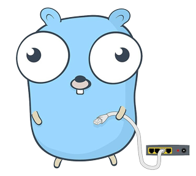
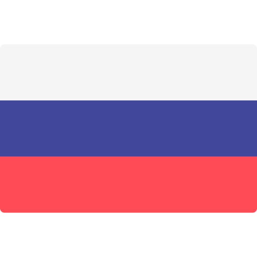

# 🔌 Fiber Web Framework

[](https://github.com/gofiber/fiber/releases)  [](https://godoc.org/github.com/gofiber/fiber)  [](https://github.com/gofiber/fiber/blob/master/LICENSE) [](https://gitter.im/FiberGo/community)



**[Fiber](https://github.com/gofiber/fiber)** is an [Express.js](https://expressjs.com/en/4x/api.html) styled HTTP web framework implementation running on [Fasthttp](https://github.com/valyala/fasthttp), the **fastest** HTTP engine for Go (Golang). The package make use of **similar framework convention** as they are in Express.

People switching from [Node.js](https://nodejs.org/en/about/) to [Go](https://golang.org/doc/) often end up in a bad learning curve to start building their webapps, this project is meant to **ease** things up for **fast** development, but with **zero memory allocation** and **performance** in mind.

**In other languages:** <a href="README_RU.md"></a>

## API Documentation

📚 We created an extended **API documentation** (_including examples_), **[click here](https://gofiber.github.io/fiber/)**.

## Benchmark

[](https://gofiber.github.io/fiber/#/benchmarks)

👉 **[Click here](https://gofiber.github.io/fiber/#/benchmarks)** to see all benchmark results.

## Features

- Optimized for speed and low memory usage
- Rapid Server-Side Programming
- Easy routing with parameters
- Static files with custom prefix
- Middleware with Next support
- Express API endpoints
- [Extended documentation](https://gofiber.github.io/fiber/)

## Installing

Assuming you’ve already installed Go `1.11+` 😉

Install the [Fiber](https://github.com/gofiber/fiber) package by calling the following command:

```bash
go get -u github.com/gofiber/fiber
```

## Hello, world!

Embedded below is essentially the simplest Fiber app you can create:

```go
// server.go

package main

import "github.com/gofiber/fiber"

func main() {
  // Create new Fiber instance
  app := fiber.New()

  // Create new route with GET method
  app.Get("/", func(c *fiber.Ctx) {
    c.Send("Hello, World!")
  })

  // Start server on http://localhost:8080
  app.Listen(8080)
}
```

Go to console and run:

```bash
go run server.go
```

And now, browse to `http://localhost:8080` and you should see `Hello, World!` on the page! 🎉

## Static files

To serve static files, use the [Static](https://gofiber.github.io/fiber/#/?id=static-files) method:

```go
package main

import "github.com/gofiber/fiber"

func main() {
  // Create new Fiber instance
  app := fiber.New()

  // Serve all static files on ./public folder
  app.Static("./public")

  // Start server on http://localhost:8080
  app.Listen(8080)
}
```

Now, you can load the files that are in the public directory:

```bash
http://localhost:8080/hello.html
http://localhost:8080/js/script.js
http://localhost:8080/css/style.css
```

## Middleware

Middleware has never been so easy! Just like Express you call the `Next()` matching route function:

```go
package main

import "github.com/gofiber/fiber"

func main() {
  // Create new Fiber instance
  app := fiber.New()

  // Define all used middlewares in Use()

  app.Use(func(c *fiber.Ctx) {
    c.Write("Match anything!\n")
    c.Next()
  })

  app.Use("/api", func(c *fiber.Ctx) {
    c.Write("Match starting with /api\n")
    c.Next()
  })

  app.Get("/api/user", func(c *fiber.Ctx) {
    c.Write("Match exact path /api/user\n")
  })

  // Start server on http://localhost:8080
  app.Listen(8080)
}
```

## Project assistance

If you want to say «thank you» or/and support active development `gofiber/fiber`:

1. Add a GitHub Star to project.
2. Twit about project [on your Twitter](https://twitter.com/intent/tweet?text=%F0%9F%94%8C%20Fiber%20is%20an%20Express.js%20inspired%20Go%20web%20framework%20build%20on%20%F0%9F%9A%80%20Fasthttp%20https%3A%2F%2Fgithub.com%2Fgofiber%2Ffiber).
3. Help us to translate this `README` and [API Docs](https://gofiber.github.io/fiber/) to another language.

Thanks for your support! 😘 Together, we make `Fiber Web Framework` better every day.

## Stargazers over time

[](https://starchart.cc/gofiber/fiber)

## License

⚠️ _Please note:_ `gofiber/fiber` is free and open-source software licensed under the [MIT License](https://github.com/gofiber/fiber/edit/master/LICENSE).
