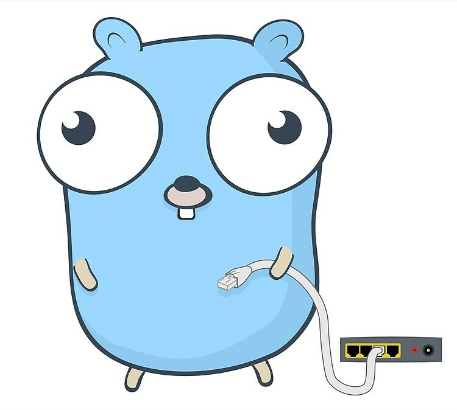

<br><br>
[](https://github.com/fenny/fiber/releases/latest)
[](http://godoc.org/github.com/fenny/fiber)
[](https://goreportcard.com/report/github.com/fenny/fiber)
[](https://github.com/fenny/fiber/blob/master/LICENSE)
[](https://gitter.im/FiberGo/community)
<br><br>
**[Fiber](https://github.com/fenny/fiber)** is a router framework build on top of **[FastHTTP](https://github.com/valyala/fasthttp)**, the fastest HTTP package for **[Go](https://golang.org/doc/)**.<br>
This library is inspired by **[Express](https://expressjs.com/en/4x/api.html)**, one of the most populair and well known web framework for **[Nodejs](https://nodejs.org/en/about/)**.

## Full API Documentation
*[Click here](https://fenny.github.io/fiber/)*

## Installing
Assuming you’ve already installed [Go](https://golang.org/doc/), install the [Fiber](https://github.com/fenny/fiber) package by calling the following command:
```shell
$ go get -u github.com/fenny/fiber
```

## Hello world
Embedded below is essentially the simplest Fiber app you can create.
```shell
$ create server.go
```
```go
package main

import "github.com/fenny/fiber"

func main() {
	app := fiber.New()
	app.Get("/", func(c *fiber.Ctx) {
		c.Send("Hello, World!")
	})
	app.Listen(8080)
}
```
```shell
$ go run server.go
```
Browse to http://localhost:8080 and you should see Hello, World! on the page.

## Basic routing
Routing refers to determining how an application responds to a client request to a particular endpoint, which is a URI (or path) and a specific HTTP request method (GET, POST, and so on).

Each route can have one handler function, that is executed when the route is matched.

Route definition takes the following structures:

```go
// Function signature
app.Method(path string, static string)
app.Method(path string, func(*fiber.Ctx))
app.Method(static string)
app.Method(func(*fiber.Ctx))
```

* **app** is an instance of **[Fiber](#hello-world)**.
* **Method** is an [HTTP request method](https://en.wikipedia.org/wiki/Hypertext_Transfer_Protocol#Request_methods), in capitalization: Get, Put, Post etc
* **path string** is a path or prefix (for static files) on the server.
* **static string** is a file path or directory.
* **func(*fiber.Ctx)** is a function executed when the route is matched.

This tutorial assumes that an instance of fiber named app is created and the server is running. If you are not familiar with creating an app and starting it, see the [Hello world](#hello-world) example.

The following examples illustrate defining simple routes.  
```go
// Respond with Hello, World! on the homepage:
app.Get("/", func(c *fiber.Ctx) {
	c.Send("Hello, World!")
})

//Respond to POST request on the root route (/), the application’s home page:
app.Post("/", func(c *fiber.Ctx) {
	c.Send("Got a POST request")
})

// Respond to a PUT request to the /user route:
app.Put("/user", func(c *fiber.Ctx) {
	c.Send("Got a PUT request at /user")
})

// Respond to a DELETE request to the /user route:
app.Delete("/user", func(c *fiber.Ctx) {
	c.Send("Got a DELETE request at /user")
})
```

## Static files
To serve static files such as images, CSS files, and JavaScript files, replace your function handler with a file or directory string.
```go
// Function signature
app.Method(static string)
app.Method(path string, static string)
```
For example, use the following code to serve images, CSS files, and JavaScript files in a directory named public:

```go
app.Get("./public")
```
Now, you can load the files that are in the public directory:
```shell
http://localhost:8080/images/kitten.jpg
http://localhost:8080/css/style.css
http://localhost:8080/js/app.js
http://localhost:8080/images/bg.png
http://localhost:8080/hello.html
```
To use multiple static assets directories, call the express.static middleware function multiple times:
```go
app.Get("./public")
app.Get("./files")
```
?>For best results, use a reverse proxy cache like [NGINX](https://www.nginx.com/resources/wiki/start/topics/examples/reverseproxycachingexample/) to improve performance of serving static assets.  

To create a virtual path prefix (where the path does not actually exist in the file system) for files that are served by the express.static function, specify a mount path for the static directory, as shown below:
```go
app.Get("/static", "./public")
```
Now, you can load the files that are in the public directory from the /static path prefix.
```shell
http://localhost:8080/static/images/kitten.jpg
http://localhost:8080/static/css/style.css
http://localhost:8080/static/js/app.js
http://localhost:8080/static/images/bg.png
http://localhost:8080/static/hello.html
```

*Caught a mistake? [Edit this page on GitHub!](https://github.com/Fenny/fiber/blob/master/README.md)*
