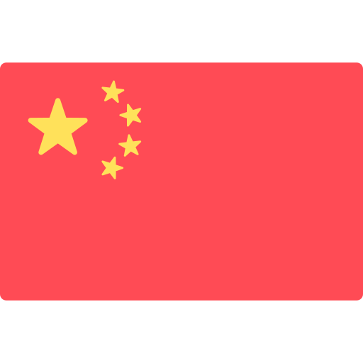

# 🔌 Веб фреймворк Fiber

[](https://github.com/gofiber/fiber/releases)  [](https://godoc.org/github.com/gofiber/fiber)  [](https://github.com/gofiber/fiber/blob/master/LICENSE) [](https://gitter.im/gofiber/community)


**[Fiber](https://github.com/gofiber/fiber)** — это [Express.js](https://expressjs.com/en/4x/api.html) подобный HTTP веб фреймворк, использующий всю мощь [Fasthttp](https://github.com/valyala/fasthttp), самого **быстрого** HTTP движка для Go (Golang). Мы используем **аналогичную** схему именования методов, как и у Express.

Разработчики, пришедшие из [Node.js](https://nodejs.org/en/about/) в [Go](https://golang.org/doc/) очень часто испытывают трудности при создании своих первых веб-приложений. Данный проект призван, в том числе, **облегчить** процесс перехода для таких разработчиков.

**На других языках:** <a href="README.md"></a> <a href="README_CH.md"></a>

## Документация по API

📚 Мы создали расширенную **документацию по API** (_включая примеры_), **[посмотреть](https://gofiber.github.io/fiber/)**.

## Бенчмарк

[](https://gofiber.github.io/fiber/#/benchmarks)

👉 **[Click here](https://gofiber.github.io/fiber/#/benchmarks)** to see all benchmark results.

## Особенности

- Оптимизирован для скорости и низкого использования памяти
- Быстрое Server-Side программирование
- Простая маршрутизация с параметрами
- Статические файлы с пользовательским префиксом
- Middleware с поддержкой `Next()`
- Endpoints, как у API Express
- [Расширенная документация](https://gofiber.github.io/fiber/)

## Установка

Предположим, вы уже установили Go `1.11+` 😉

Установит пакет [Fiber](https://github.com/gofiber/fiber) с помощью следующей команды в консоле:

```bash
go get -u github.com/gofiber/fiber
```

## Hello, world!

Веб-приложение ниже, по сути, является самым простым приложением, которое вы можете создать:

```go
// server.go

package main

import "github.com/gofiber/fiber"

func main() {
  // Создание нового инстанса Fiber
  app := fiber.New()

  // Создание маршрута с GET
  app.Get("/", func(c *fiber.Ctx) {
    c.Send("Hello, World!")
  })

  // Старт сервера на http://localhost:8080
  app.Listen(8080)
}
```

Перейдите в консоль и запустите:

```bash
go run server.go
```

А теперь, откройте в браузере адрес `http://localhost:8080`. Вы должы увидеть надпись `Hello, World!`! 🎉

## Статичные файлы

Для получения доступа к статичным файлам, используйте метод [Static](https://gofiber.github.io/fiber/#/?id=static-files):

```go
package main

import "github.com/gofiber/fiber"

func main() {
  // Создание нового инстанса Fiber
  app := fiber.New()

  // Включение всех файлов в папке ./public для работы
  app.Static("./public")

  // Старт сервера на http://localhost:8080
  app.Listen(8080)
}
```

Теперь вы можете получить доступ ко всем файлам, которые находятся в папке `./public`:

```bash
http://localhost:8080/hello.html
http://localhost:8080/js/script.js
http://localhost:8080/css/style.css
```

## Middleware

Еще никогда работа с middleware не была настолько простой! Так же, как и в Express, вы должны вызывать метод `Next()` для дальнейшего следования по маршрутам роутера:

```go
package main

import "github.com/gofiber/fiber"

func main() {
  // Создание нового инстанса Fiber
  app := fiber.New()

  // Определяем все необходимые middlewares
  // с помощью метода Use()

  app.Use(func(c *fiber.Ctx) {
    c.Write("Match anything!\n")
    c.Next()
  })

  app.Use("/api", func(c *fiber.Ctx) {
    c.Write("Match starting with /api\n")
    c.Next()
  })

  app.Get("/api/user", func(c *fiber.Ctx) {
    c.Write("Match exact path /api/user\n")
  })

  // Старт сервера на http://localhost:8080
  app.Listen(8080)
}
```

## Помощь проекту

Если вы хотите сказать «спасибо» и/или помочь активной разработке `gofiber/fiber`:

1. Добавьте звёздочку GitHub этому репозиторию.
2. Отправьте твит об этом проекте [в свой Twitter](https://twitter.com/intent/tweet?text=%F0%9F%94%8C%20Fiber%20is%20an%20Express.js%20inspired%20Go%20web%20framework%20build%20on%20%F0%9F%9A%80%20Fasthttp%20https%3A%2F%2Fgithub.com%2Fgofiber%2Ffiber).
3. Помогите нам перевести `README` и [Документацию по API](https://gofiber.github.io/fiber/) на другой язык.

Спасибо за поддержку! 😘 Вместе мы делаем `Fiber Web Framework` лучше каждый день.

## Звёздочки с течением времени

[](https://starchart.cc/gofiber/fiber)

## Лицензия

⚠️ _Обратите внимание:_ `gofiber/fiber` является свободным программным обеспечением с открытым исходным кодом, лицензируемым в соответствии с [MIT License](LICENSE).
