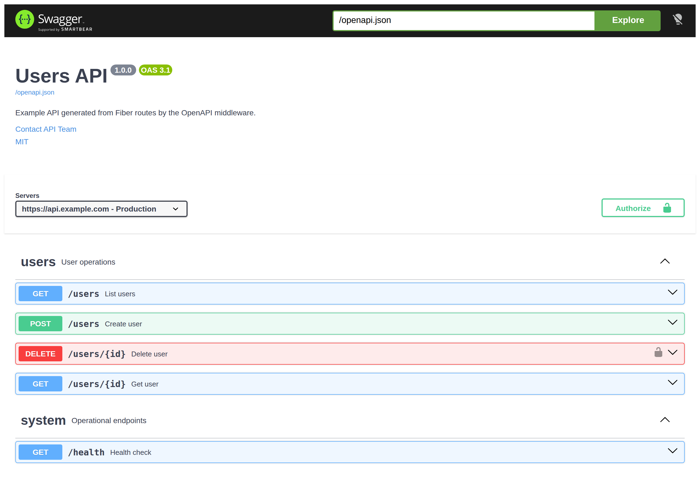
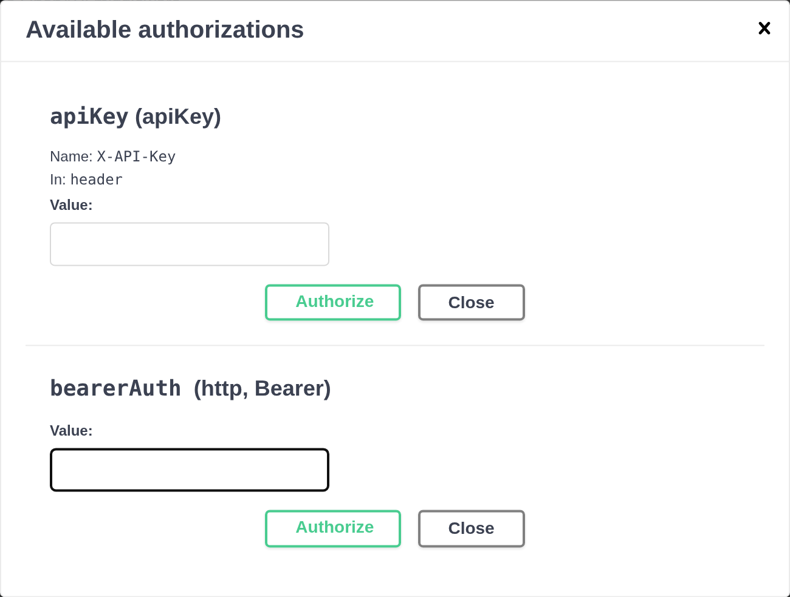
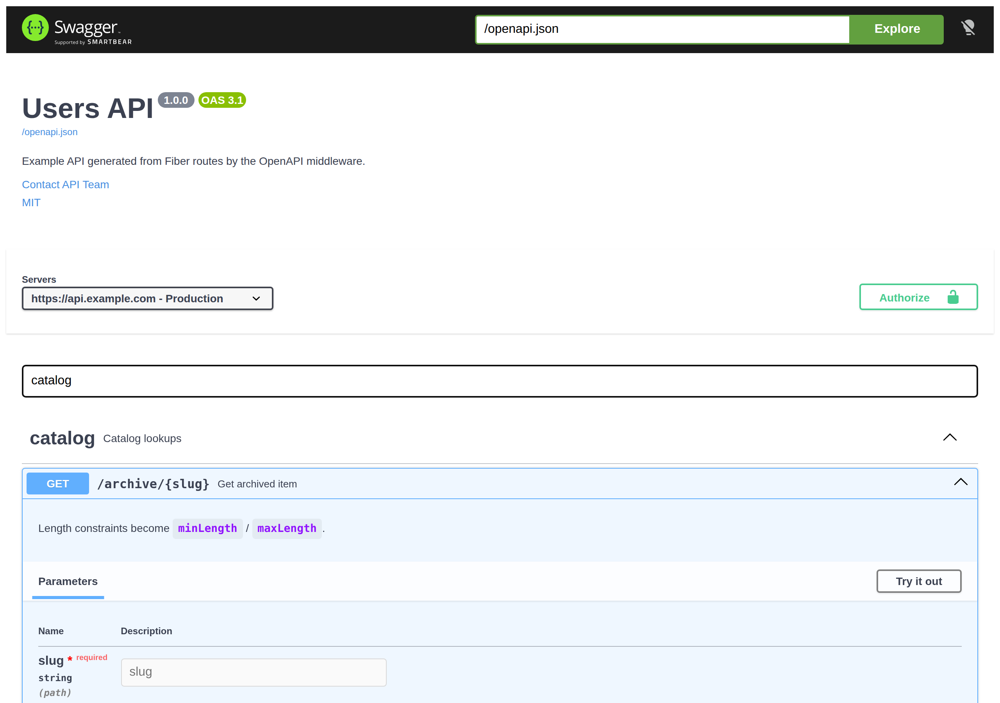
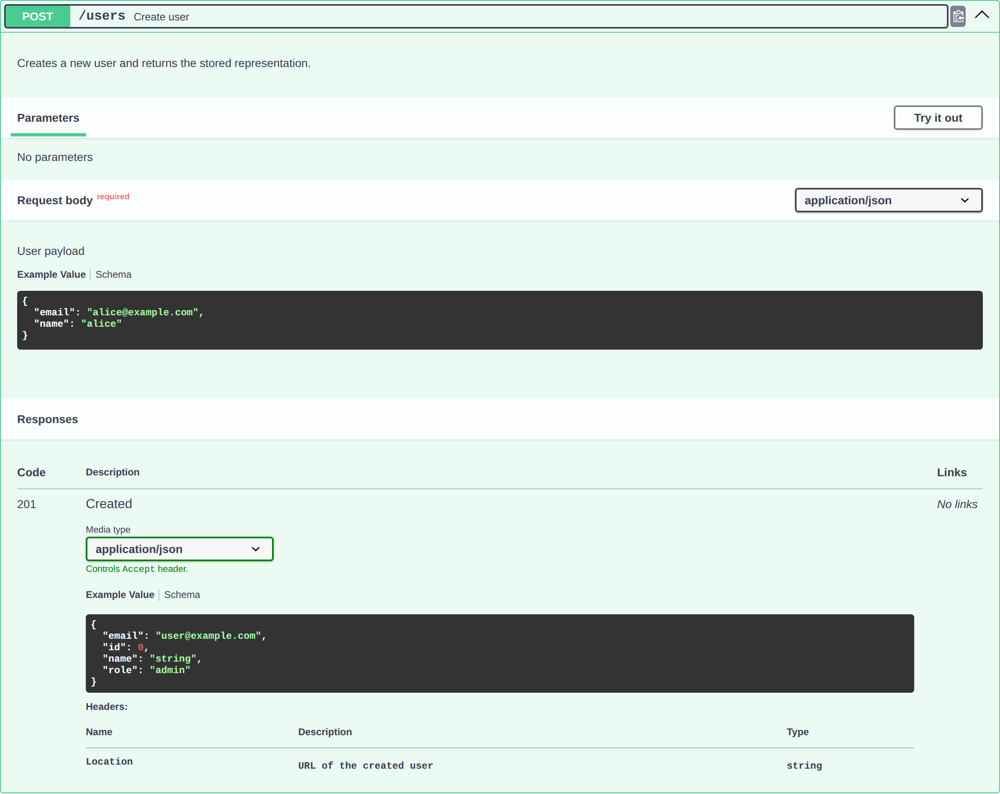
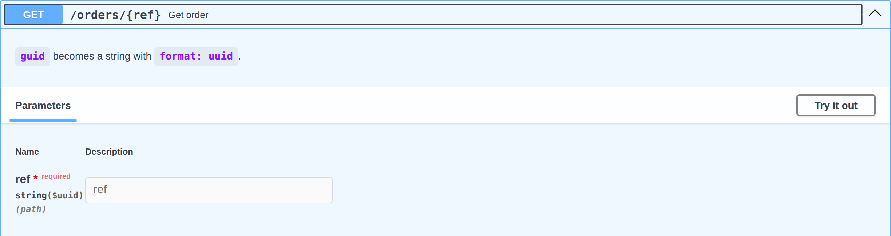
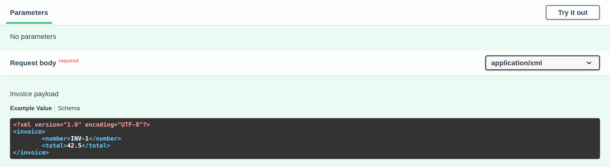
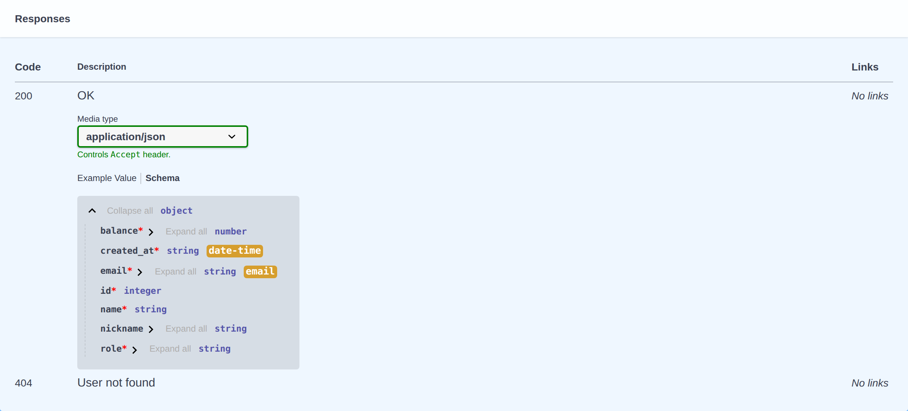

# OpenAPI

OpenAPI middleware for [Fiber](https://github.com/gofiber/fiber) that generates an OpenAPI specification based on the routes registered in your application.

This middleware supports the OpenAPI 3.0.0, 3.1.0 and 3.2.0 specifications.

## Signatures

```go
func New(config ...Config) fiber.Handler
```

## Examples

### Import

Import the middleware package that is part of the Fiber web framework:

```go
import (
    "github.com/gofiber/fiber/v3"
    "github.com/gofiber/fiber/v3/middleware/openapi"
)
```

### Quick start

Register the middleware after your routes. With the default config it serves the
generated specification at `GET /openapi.json` and a Swagger UI page at
`GET /swagger`:

```go
app.Use(openapi.New())
```

Visiting `/swagger` renders the generated document. Everything below comes from
the routes themselves and from `Config` — the tag groups, the server list and the
**Authorize** button all appear because the sections further down configure them:



The middleware inspects the app's routes and generates the spec on the first
matching request. The spec is cached, but the cache is automatically invalidated
whenever the route table changes — routes added or removed, or route
documentation metadata mutated — so changes after the first request are still
reflected without a restart. Requests to other paths pass through without
generation work.

### Document metadata

Set top-level information about the API — title, version, contact, license,
servers, tags, external docs and reusable components:

```go
app.Use(openapi.New(openapi.Config{
    Title:          "My API",
    Version:        "1.0.0",
    OpenAPIVersion: "3.1.0", // or "3.0.0"
    Description:    "Example API",
    TermsOfService: "https://example.com/terms",
    Contact:        &openapi.Contact{Name: "API Team", Email: "api@example.com"},
    License:        &openapi.License{Name: "MIT", URL: "https://opensource.org/licenses/MIT"},
    // Servers takes precedence over ServerURL and supports multiple entries.
    Servers: []openapi.Server{
        {URL: "https://prod.example.com", Description: "Production"},
        {URL: "https://staging.example.com", Description: "Staging"},
    },
    // Top-level tag definitions and external documentation.
    Tags:         []openapi.Tag{{Name: "users", Description: "User operations"}},
    ExternalDocs: &openapi.ExternalDocs{Description: "Docs", URL: "https://docs.example.com"},
    // Components holds reusable schema definitions that $ref targets resolve to.
    Components: map[string]any{
        "schemas": map[string]any{
            "User": map[string]any{
                "type": "object",
                "properties": map[string]any{
                    "name":  map[string]any{"type": "string"},
                    "email": map[string]any{"type": "string"},
                },
            },
        },
    },
}))
```

### Authentication (security schemes)

`SecuritySchemes` are emitted under `components.securitySchemes`; `Security` sets
the document-level (default) requirement applied to every operation:

```go
app.Use(openapi.New(openapi.Config{
    SecuritySchemes: map[string]any{
        "bearerAuth": map[string]any{
            "type":         "http",
            "scheme":       "bearer",
            "bearerFormat": "JWT",
        },
    },
    Security: []map[string][]string{
        {"bearerAuth": {}},
    },
}))
```

Each scheme becomes an entry in the UI's **Authorize** dialog, rendered from its
own type — an `http`/`bearer` scheme asks for a token, while an `apiKey` scheme
also shows the header name it will be sent in:



Operations carrying a requirement show a padlock in their row, so it is visible
which endpoints need credentials without expanding them.

### Customize the Swagger UI

Change the spec/UI paths and the CDN asset URLs, and pass extra options to the
`SwaggerUIBundle` call:

```go
app.Use(openapi.New(openapi.Config{
    Path:                       "/spec.json",
    UIPath:                     "/docs",
    SwaggerCSSURL:              "https://cdn.example.com/swagger-ui.css",
    SwaggerBundleURL:           "https://cdn.example.com/swagger-ui-bundle.js",
    SwaggerStandalonePresetURL: "https://cdn.example.com/swagger-ui-standalone-preset.js",
    SwaggerOptions: map[string]any{
        "docExpansion": "list",
        "deepLinking":  true,
    },
}))
```

`SwaggerOptions` is merged into the `SwaggerUIBundle` call, so anything Swagger
UI itself supports works here. With `"filter": true` and `"docExpansion":
"full"`, for example, the page gains a tag filter box and opens every operation
on load:



Any asset URL you leave unset keeps its `unpkg.com` default; see
[Offline and air-gapped deployments](#offline-and-air-gapped-deployments) to
serve all three yourself.

### Offline and air-gapped deployments

The generated specification is served by the middleware itself and never leaves
your process. The Swagger UI **page**, however, is plain HTML that tells the
browser to fetch three assets, and by default those point at the `unpkg.com` CDN:

| Config field                 | Asset                            |
|:-----------------------------|:---------------------------------|
| `SwaggerCSSURL`              | `swagger-ui.css`                 |
| `SwaggerBundleURL`           | `swagger-ui-bundle.js`           |
| `SwaggerStandalonePresetURL` | `swagger-ui-standalone-preset.js` |

In an air-gapped network, behind a proxy, or under a strict `Content-Security-Policy`,
those requests fail and the UI renders as a blank page. Vendor the assets and point
all three fields at your own URLs.

:::caution Override all three
An empty string means "use the default", not "disable". Overriding only
`SwaggerCSSURL` and `SwaggerBundleURL` leaves `SwaggerStandalonePresetURL`
pointing at the CDN, and the page still makes one outbound request. Set every
field you do not want fetched from `unpkg.com`.
:::

#### 1. Vendor the assets

Pin the same version the middleware defaults to, so the UI you test is the UI you
ship:

```bash
mkdir -p public/swagger-ui
npm pack swagger-ui-dist@5.32.6
tar -xzf swagger-ui-dist-5.32.6.tgz
cp package/swagger-ui.css \
   package/swagger-ui-bundle.js \
   package/swagger-ui-standalone-preset.js \
   public/swagger-ui/
```

Copy the matching `*.js.map` files too if you want source maps in devtools; the
UI works without them.

#### 2. Serve them and point the config at them

This is the complete program — one binary, no network access required at runtime:

```go
package main

import (
    "embed"
    "io/fs"
    "log"

    "github.com/gofiber/fiber/v3"
    "github.com/gofiber/fiber/v3/middleware/openapi"
    "github.com/gofiber/fiber/v3/middleware/static"
)

// The assets are compiled into the binary, so there is nothing to deploy
// alongside it.
//
//go:embed public/swagger-ui
var swaggerAssets embed.FS

type User struct {
    ID   int    `json:"id"`
    Name string `json:"name"`
}

func main() {
    // embed.FS keeps the full "public/swagger-ui" path from the directive
    // above; fs.Sub strips it so the files sit at the root of the served FS.
    assets, err := fs.Sub(swaggerAssets, "public/swagger-ui")
    if err != nil {
        log.Fatal(err)
    }

    app := fiber.New()

    app.Get("/users/:id<int>", func(c fiber.Ctx) error {
        return c.JSON(User{ID: 1, Name: "alice"})
    }).
        Summary("Get user").
        ResponseWithExample(
            fiber.StatusOK, "OK",
            openapi.SchemaOf(User{}), "", nil, nil,
            fiber.MIMEApplicationJSON,
        )

    // Serve the vendored assets at /swagger-ui/*.
    app.Use("/swagger-ui", static.New("", static.Config{FS: assets}))

    app.Use(openapi.New(openapi.Config{
        Title:   "My API",
        Version: "1.0.0",
        // All three, or the page still reaches for the CDN.
        SwaggerCSSURL:              "/swagger-ui/swagger-ui.css",
        SwaggerBundleURL:           "/swagger-ui/swagger-ui-bundle.js",
        SwaggerStandalonePresetURL: "/swagger-ui/swagger-ui-standalone-preset.js",
    }))

    log.Fatal(app.Listen(":3000"))
}
```

To ship the assets as files on disk instead of embedding them, swap the static
registration for a directory and drop the `embed`/`fs.Sub` plumbing:

```go
app.Use("/swagger-ui", static.New("./public/swagger-ui"))
```

#### 3. Verify nothing escapes

```bash
curl -s http://localhost:3000/swagger | grep -o 'https\?://[^"]*'
```

The command should print nothing. Any URL it does print is still being fetched
from the internet.

:::note Cross-origin assets
The generated `<script>` tags carry `crossorigin="anonymous"`. Assets served from
the same origin as the app — as above — are unaffected. If you host them on a
separate origin (an internal CDN, a different port), that origin must send
`Access-Control-Allow-Origin`, or the browser will refuse the scripts.
:::

### Document a route

Routes can document themselves with `Summary`, `Description`, `RequestBody`,
`Parameter`, `Response`, `Tags`, `Deprecated`, `Produces` and `Consumes`. Use the
`*WithExample` helpers to attach schemas and examples (including `$ref`):

```go
app.Post("/users", createUser).
    Summary("Create user").
    Description("Creates a new user").
    RequestBodyWithExample(
        "User payload", true,
        nil, "#/components/schemas/User",
        map[string]any{"name": "alice"},
        map[string]any{"sample": map[string]any{"name": "bob"}},
        fiber.MIMEApplicationJSON,
    ).
    ParameterWithExample(
        "trace-id", "header", true, nil, "",
        "Tracing identifier", "abc-123", map[string]any{"sample": "xyz-789"},
    ).
    ResponseWithExample(
        fiber.StatusCreated, "Created",
        nil, "#/components/schemas/UserResponse",
        map[string]any{"id": 1},
        map[string]any{"sample": map[string]any{"id": 2}},
        fiber.MIMEApplicationJSON,
    ).
    Tags("users", "admin").
    Produces(fiber.MIMEApplicationJSON)
```

Expanding that operation in the UI shows where each helper lands: `Description`
under the summary, `RequestBodyWithExample` as the **Example Value**,
`ResponseWithExample` as the response body, and `ResponseHeader` as the headers
table beneath it:



### Per-operation security

Attach security requirements to a single operation. Multiple requirements are
combined with OR; pass an empty requirement (`map[string][]string{}`) to document
"no auth" and override the document-level default:

```go
app.Get("/users", listUsers).
    Security(map[string][]string{"bearerAuth": {}})
```

### Advanced parameters

`AddParameter` takes a full `fiber.RouteParameter`, exposing the serialization
fields (`Deprecated`, `Style`, `Explode`, `AllowEmptyValue`, `AllowReserved`) that
the simpler `Parameter`/`ParameterWithExample` helpers do not:

```go
explode := false
app.Get("/items", listItems).
    AddParameter(fiber.RouteParameter{
        Name:    "ids",
        In:      "query",
        Style:   "form",
        Explode: &explode,
        Schema:  map[string]any{"type": "array", "items": map[string]any{"type": "string"}},
    })
```

### Path parameter constraints

Path parameters are derived from the route pattern, and a
[route constraint](../guide/routing.md#constraints) narrows the generated schema
automatically — no `AddParameter` call needed:

```go
app.Get("/users/:id<int>", getUser)                  // {"type": "integer"}
app.Get("/orders/:ref<guid>", getOrder)              // {"type": "string", "format": "uuid"}
app.Get("/pages/:n<range(1,10)>", getPage)           // {"type": "integer", "minimum": 1, "maximum": 10}
```

| Constraint | Generated schema |
| --- | --- |
| `int` | `{"type": "integer"}` |
| `bool` | `{"type": "boolean"}` |
| `float` | `{"type": "number"}` |
| `alpha` | `{"type": "string"}` |
| `guid` | `{"type": "string", "format": "uuid"}` |
| `datetime(layout)` | `{"type": "string"}`, plus `format` for the `date`, `time` and `date-time` layouts |
| `regex(p)` | `{"type": "string", "pattern": "p"}` |
| `minLen(n)` / `maxLen(n)` / `len(n)` / `betweenLen(a,b)` | `{"type": "string"}` with `minLength` / `maxLength` |
| `min(n)` / `max(n)` / `range(a,b)` | `{"type": "integer"}` with `minimum` / `maximum` |

The derived schema is what the UI renders for the parameter — no `AddParameter`
call produced the `string($uuid)` below, only the `<guid>` in the route pattern:



Chained constraints (`:id<int;min(5)>`) are merged, with the first constraint that
sets a keyword keeping it. A custom or unrecognized constraint leaves the default
`{"type": "string"}` rather than guessing. An explicit `AddParameter` for the
same name wins over the derived schema when it supplies one; a call that only
adds a description or an example keeps the derived schema.

`alpha` accepts any Unicode letter at runtime, so no `pattern` is emitted: an
ASCII-only pattern would document the route as stricter than it is.

The length constraints count UTF-8 **bytes** at runtime, while JSON Schema's
`minLength`/`maxLength` count **characters**. The two agree for ASCII values; for
non-ASCII ones the emitted bound is an approximation, so document such parameters
explicitly with `AddParameter` if the exact bound matters.

### Response headers

`ResponseHeader(status, name, description, schema)` documents a response header
for a given status code, creating the response entry if it does not exist yet:

```go
app.Post("/users", createUser).
    Response(fiber.StatusCreated, "Created", fiber.MIMEApplicationJSON).
    ResponseHeader(fiber.StatusCreated, "Location", "URL of the created user", map[string]any{"type": "string"})
```

### Response links

`ResponseLink(status, name, link)` documents an OpenAPI link for a response:

```go
app.Post("/users", createUser).
    Response(fiber.StatusCreated, "Created", fiber.MIMEApplicationJSON).
    ResponseLink(fiber.StatusCreated, "getUserById", map[string]any{
        "operationId": "getUsersId",
        "parameters":  map[string]any{"id": "$response.body#/id"},
    })
```

### The `default` response

A status of `0` addresses the OpenAPI `default` response — the one that applies
to any status code not listed explicitly. Every status-taking helper accepts it:

```go
app.Get("/users", listUsers).
    Response(fiber.StatusOK, "OK", fiber.MIMEApplicationJSON).
    ResponseWithExample(
        0, "Unexpected error",
        nil, "#/components/schemas/Error", nil, nil,
        fiber.MIMEApplicationJSON,
    ).
    ResponseHeader(0, "X-Request-Id", "Correlation id", map[string]any{"type": "string"})
```

`Response`/`ResponseWithExample` replace an empty description with the status
text (`"OK"`, `"Not Found"`, …, or `"Default response"` for `0`), and preserve
any headers, links and content already documented for the same status.
`ResponseContent` instead leaves the description untouched when given an empty
one, so it can add content to an entry another call described.

### Per-media-type content

`RequestBodyContent` and `ResponseContent` accept a map of media type to
`fiber.RouteMediaType`, so each content type can carry a different schema, example
and `encoding`:

```go
app.Post("/users", createUser).
    RequestBodyContent("User payload", true, map[string]fiber.RouteMediaType{
        fiber.MIMEApplicationJSON: {Schema: openapi.SchemaOf(User{})},
        fiber.MIMEApplicationXML:  {SchemaRef: "#/components/schemas/User"},
    }).
    ResponseContent(fiber.StatusCreated, "Created", map[string]fiber.RouteMediaType{
        fiber.MIMEApplicationJSON: {Schema: openapi.SchemaOf(User{})},
    })
```

The UI offers one entry per media type and swaps the schema and example with the
selection, so the XML variant is documented separately from the JSON one rather
than sharing its shape:



:::note XML examples
Give an XML schema an [XML Object](https://spec.openapis.org/oas/v3.1.0#xml-object)
(`"xml": map[string]any{"name": "invoice"}`) naming the root element. Without it
Swagger UI has no element name to build from and renders a placeholder comment
instead of an example.
:::

`RouteParameter.Content` does the same for a parameter whose value is not a plain
scalar — for example a JSON-encoded query parameter. A Parameter Object carries
either `schema` or `content` and never both, so setting `Content` discards any
`Schema`/`SchemaRef` on the same parameter:

```go
app.Get("/users", listUsers).
    AddParameter(fiber.RouteParameter{
        Name: "filter",
        In:   "query",
        Content: map[string]fiber.RouteMediaType{
            fiber.MIMEApplicationJSON: {Schema: openapi.SchemaOf(Filter{})},
        },
    })
```

### Operation external docs & extensions

`OperationExternalDocs` sets the operation's `externalDocs`, and
`OperationExtension` shallow-merges any other operation-object fields (such as
`servers`, `callbacks` or `x-*` extensions) without clobbering generated keys:

```go
app.Get("/users", listUsers).
    OperationExternalDocs("More info", "https://docs.example.com/list-users").
    OperationExtension(map[string]any{
        "servers": []any{map[string]any{"url": "https://users.example.com"}},
    })
```

### Hide a route

`Hidden()` excludes a route from the generated specification entirely — useful for
internal or admin endpoints:

```go
app.Get("/internal/metrics", metricsHandler).Hidden()
```

### QUERY routes (OpenAPI 3.2)

The HTTP `QUERY` method maps to the OpenAPI `query` operation, which exists only
in OpenAPI 3.2. Register the route with `app.Query(...)` and select 3.2; it
documents like any other operation (and, unlike `GET`, may carry a request body):

```go
app.Use(openapi.New(openapi.Config{OpenAPIVersion: "3.2.0"}))

app.Query("/search", searchHandler).
    Summary("Search").
    RequestBody("Search criteria", true, fiber.MIMEApplicationJSON)
```

When `OpenAPIVersion` is `3.0.0` or `3.1.0`, `QUERY` routes are omitted from the
spec because those versions cannot represent the operation.

### OpenAPI 3.2 document fields

3.2 adds a few typed fields the middleware emits when `OpenAPIVersion` is
`"3.2.0"` (and `License.Identifier` for 3.1+):

```go
app.Use(openapi.New(openapi.Config{
    OpenAPIVersion: "3.2.0",
    Self:           "https://example.com/openapi.json", // $self
    License:        &openapi.License{Name: "Apache 2.0", Identifier: "Apache-2.0"},
    Servers: []openapi.Server{
        {URL: "https://api.example.com", Name: "production"}, // Server.name
    },
}))
```

A parameter may also use the 3.2 `querystring` location, which describes the whole
query string as a single value. That location is only valid with `content`, so the
middleware wraps whatever `Schema` you supply (defaulting to `{"type": "string"}`)
into an `application/x-www-form-urlencoded` entry. Set `Content` explicitly to pick
a different media type:

```go
app.Get("/search", searchHandler).
    AddParameter(fiber.RouteParameter{Name: "q", In: "querystring", Schema: map[string]any{"type": "string"}})

app.Get("/report", reportHandler).
    AddParameter(fiber.RouteParameter{
        Name: "q",
        In:   "querystring",
        Content: map[string]fiber.RouteMediaType{
            fiber.MIMEApplicationJSON: {Schema: map[string]any{"type": "object"}},
        },
    })
```

`querystring` parameters are dropped from the document when `OpenAPIVersion` is
below `"3.2.0"`, where the location does not exist.

Other 3.2 additions live inside objects the middleware passes through as raw maps,
so they need no special API — supply them via `Components` / schemas / security
schemes: security device-authorization flow and `oauth2MetadataUrl`, XML
`nodeType`, Media Type `itemSchema` (sequential/streaming media), Path Item
`additionalOperations`, and `components.mediaTypes`.

### Validation

The documentation helpers reject arguments that could only produce an invalid
document, and they do it at registration time — a panic during startup rather
than a malformed spec served in production:

| Helper | Panics when |
|:-------|:------------|
| `Consumes`, `Produces`, `RequestBody*`, `Response*`, `RequestBodyContent`, `ResponseContent` | a media type is not a parseable `type/subtype` |
| `RequestBody`, `RequestBodyWithExample` | no usable media type is given |
| `Parameter*`, `AddParameter` | the name is empty, `In` is not `path`/`query`/`header`/`cookie`/`querystring`, or `Content` holds more than one media type |
| `Response*`, `ResponseHeader`, `ResponseLink`, `ResponseContent` | the status is outside 100–599 (`0` is allowed and means `default`) |
| `ResponseHeader`, `ResponseLink` | the header or link name is empty |

Passing an empty string to `Consumes`/`Produces` is not an error: it clears the
route's media type.

### Behavior and defaults

- If a route declares no responses, a sensible default is added: `200 OK` for most
  methods and `204 No Content` for `DELETE`, one of the statuses RFC 9110 names
  for a successful delete. `HEAD` mirrors `GET` (`200 OK`, plus the `Produces`
  media type if set) because RFC 9110 has a `HEAD` response carry the same header
  fields as the `GET` would, minus the content. Declaring any response via the
  helpers disables the automatic default.
- Operations without metadata default to a summary of `"METHOD /path"`, no
  `description` key at all, no tags and not deprecated. No request body or response content
  type is invented: a request body appears only when `Consumes`/`RequestBody*` is
  set explicitly, and default responses carry a description only until
  `Produces`/`Response*` declares a media type.
- A route's `Consumes`/`Produces` are inferred from the first media type passed
  to `RequestBody*` and to a `200` `Response*`, but only when `Consumes()` or
  `Produces()` did not set one explicitly.
- Each operation gets a unique `operationId`: routes documented with `Name` use
  that name; routes without one get an id generated from the method and path (for
  example `GET /users/{id}` → `getUsersId`). Collisions get a numeric suffix
  (`_2`, `_3`, …) so the document stays valid.
- Path parameters whose sanitized names collide are also suffixed (`_2`, `_3`, …)
  so parameter names stay unique per path.
- Wildcard segments (`*`, `+`) become an ordinary path parameter named
  `wildcard<n>`: `/files/*` documents as `/files/{wildcard1}`. Pass that name to
  `AddParameter` (`In: "path"`) to give it a description or a schema. Since `*`
  also matches no segment, the bare path (`/files`) is documented as well, as for
  an optional parameter; `+` requires a segment and gets no such variant.
- Routes with several optional parameters (e.g. `/files/:dir?/:name?`) emit one
  templated path per hierarchy level (`/files`, `/files/{dir}`,
  `/files/{dir}/{name}`): the router always binds the first parameter, and the
  OpenAPI specification forbids templated paths that differ only in parameter
  names. The expansion is capped at 64 variants per route, since it is otherwise
  exponential in the number of optional parameters; the fully-populated variant
  is always emitted.
- Only the `GET` and `HEAD` routes the application registers itself are
  documented. The `HEAD` route Fiber derives automatically from every `GET` is
  omitted, so a plain `app.Get(...)` produces a single `get` operation; register
  `app.Head(...)` explicitly to document one.
- The middleware itself answers only `GET` and `HEAD` requests; any other method
  on the spec or UI path falls through to the next handler.
- `GET` and `HEAD` operations never emit a `requestBody`, even if `Consumes` or
  `RequestBody` is set, because those methods do not carry a request body. The
  same applies to `TRACE`, which must not include content per RFC 9110.
- `CONNECT` routes are ignored because the OpenAPI specification does not define a
  `connect` operation.
- The documentation helpers are also available on `RouteChain` chains:
  `app.RouteChain("/users").Get(handler).Summary("List users")`. Helpers on a
  `Group`, `RouteChain`, or `Domain` router document that router's own most
  recent registration, even when other routes were registered on the app in
  the meantime; before the first registration through such a router its
  helpers are no-ops.
- Documentation helpers chained onto a sub-app mount
  (`app.Use("/api", subApp).Summary(...)`) are no-ops: mount placeholders are
  replaced by the sub-app's own routes at startup, so document the sub-app's
  routes instead.
- Registering the same method and path twice in a row merges the handlers into
  one route entry; its documentation (including `Name`) belongs to the latest
  registration. Routes registered on different domains never merge — each
  keeps its own handlers and documentation, and when two domains share a path
  the generated document (which has no host dimension) describes the
  first-registered one.
- The specification always describes the whole application the middleware runs
  in. When the middleware is registered inside a mounted sub-app, the routes are
  expanded into the parent application at startup, so the generated document
  covers the parent's full route set — use `Config.Next` to scope it if needed.
- Spec generation takes a deep snapshot of the route table under the router
  lock, so serving the spec concurrently with route registration or the
  documentation helpers is safe. Runtime route mutation itself (e.g.
  `RemoveRoute` while serving traffic) remains subject to the router's own
  `RebuildTree` thread-safety caveats.

## Config

| Property       | Type                    | Description                                                     | Default            |
|:---------------|:------------------------|:----------------------------------------------------------------|:------------------:|
| Next           | `func(fiber.Ctx) bool`  | Next defines a function to skip this middleware when returned true. | `nil` |
| Title          | `string`                | Title is the title for the generated OpenAPI specification.     | `"Fiber API"`     |
| Version        | `string`                | Version is the version for the generated OpenAPI specification. | `"1.0.0"`         |
| Description    | `string`                | Description is the description for the generated specification. | `""`             |
| ServerURL      | `string`                | ServerURL is the server URL used in the generated specification.| `""`             |
| Path           | `string`                | Path is the route where the specification will be served.       | `"/openapi.json"` |
| UIPath         | `string`                | Path is the route where the Swagger UI page will be served.     | `"/swagger"` |
| SwaggerCSSURL  | `string`                | Stylesheet URL used by the generated Swagger UI page.           | `"https://unpkg.com/swagger-ui-dist@5.32.6/swagger-ui.css"` |
| SwaggerBundleURL | `string`              | Script URL used by the generated Swagger UI page.               | `"https://unpkg.com/swagger-ui-dist@5.32.6/swagger-ui-bundle.js"` |
| SwaggerStandalonePresetURL | `string`    | Standalone preset script URL, giving the UI its `StandaloneLayout` (top bar with the Authorize button). Always loaded — an empty value selects the default rather than omitting the script. | `"https://unpkg.com/swagger-ui-dist@5.32.6/swagger-ui-standalone-preset.js"` |
| SwaggerOptions | `map[string]any`        | Additional options merged into the generated `SwaggerUIBundle` call. | `nil` |
| OpenAPIVersion | `string`                | OpenAPI specification version to generate (`"3.0.0"`, `"3.1.0"` or `"3.2.0"`) | `"3.1.0"`     |
| Components     | `map[string]any`        | Reusable OpenAPI component definitions (schemas, responses, etc.) emitted under `"components"`. | `nil` |
| SecuritySchemes | `map[string]any`       | Reusable security scheme definitions, emitted under `"components.securitySchemes"`. | `nil` |
| Security       | `[]map[string][]string` | Document-level (default) security requirements; each map is a requirement (OR semantics across entries). | `nil` |
| Contact        | `*Contact`              | Contact information for the API (`info.contact`).               | `nil` |
| License        | `*License`              | License information for the API (`info.license`).               | `nil` |
| TermsOfService | `string`                | Terms of Service URL (`info.termsOfService`).                   | `""` |
| Servers        | `[]Server`              | Servers hosting the API; takes precedence over `ServerURL`. Each `Server` supports `Variables` for URL templating. | `nil` |
| Tags           | `[]Tag`                 | Top-level tag definitions (with descriptions and optional `ExternalDocs`). | `nil` |
| ExternalDocs   | `*ExternalDocs`         | External documentation reference (`externalDocs`).             | `nil` |
| Summary        | `string`                | Short API summary (`info.summary`, OpenAPI 3.1+).             | `""` |
| Webhooks       | `map[string]any`        | Webhook definitions (`webhooks`, OpenAPI 3.1+).              | `nil` |
| JSONSchemaDialect | `string`             | Default JSON Schema dialect (`jsonSchemaDialect`, OpenAPI 3.1+). | `""` |
| Self           | `string`                | Self-assigned document URI (`$self`, OpenAPI 3.2+).          | `""` |

`Summary`, `Webhooks` and `JSONSchemaDialect` require OpenAPI 3.1+; `Self`,
`Server.Name` and `License.Identifier` are emitted only for the versions that
support them (3.2, 3.2 and 3.1+ respectively). Setting an unsupported
`OpenAPIVersion` falls back to the default.

The License Object allows `identifier` or `url`, never both. Setting both keeps
`identifier` and drops `url` on 3.1+, and does the reverse on 3.0.0 where
`identifier` does not exist. A `Server` with an empty `URL` is dropped, and
`Servers` falls back to `ServerURL` only when it contributes no usable entry.

When the middleware is attached to a group or mounted under a prefixed `Use`, the configured `Path` is resolved relative to that
prefix. For example, `app.Group("/v1").Use(openapi.New())` serves the specification at `/v1/openapi.json`, while a global
`app.Use(openapi.New())` only intercepts `/openapi.json` and will not affect other endpoints ending in `openapi.json`.
The same prefix resolution applies to `UIPath`, so `app.Group("/v1").Use(openapi.New())` also serves the Swagger UI page at
`/v1/swagger` by default.

A prefix may itself be parameterized. `app.Use("/:tenant?", openapi.New())` serves
`/acme/openapi.json` and `/openapi.json`, and `app.Use("/files/*", openapi.New())`
serves the document under whatever the wildcard matched. The prefix is resolved
per request against the number of segments the pattern can consume, so a mount
that can take at most one segment does not answer two levels down.

The middleware can also be pinned to an exact route — `app.Get("/openapi.json", openapi.New())` or
`app.Use("/v1/openapi.json", openapi.New())` serves the specification at that registered path. Note that an exact-route
mount serves only that one endpoint, so the Swagger UI needs its own registration (or a prefix `Use`) to be reachable.

## Default Config

```go
var ConfigDefault = Config{
    Next:                       nil,
    Title:                      "Fiber API",
    Version:                    "1.0.0",
    Description:                "",
    ServerURL:                  "",
    Path:                       "/openapi.json",
    UIPath:                     "/swagger",
    SwaggerCSSURL:              "https://unpkg.com/swagger-ui-dist@5.32.6/swagger-ui.css",
    SwaggerBundleURL:           "https://unpkg.com/swagger-ui-dist@5.32.6/swagger-ui-bundle.js",
    SwaggerStandalonePresetURL: "https://unpkg.com/swagger-ui-dist@5.32.6/swagger-ui-standalone-preset.js",
    SwaggerOptions:             nil,
    OpenAPIVersion:             "3.1.0",
}
```

Every field left at its zero value falls back to the entry above, so an empty
string never means "disable" — see
[Offline and air-gapped deployments](#offline-and-air-gapped-deployments) for what
that implies when replacing the CDN URLs.

Schema references (`SchemaRef`) are emitted as `$ref` entries in the generated JSON and can point to components such as `#/components/schemas/User`. To make these references resolve correctly, provide the corresponding definitions via the `Components` config field. `Example` and `Examples` follow the OpenAPI specification's mutual exclusivity rule: when both are provided, `Examples` takes precedence and `Example` is omitted.

## Automatic Schema Inference

The `SchemaOf` helper generates an OpenAPI JSON Schema from a Go struct using
reflection. Given a struct:

```go
type User struct {
    ID    int    `json:"id"`
    Name  string `json:"name"`
    Email string `json:"email" openapi:"format:email,description:User email address"`
}
```

Use the generated schema directly in the route helpers:

```go
app.Post("/users", createUser).
    RequestBodyWithExample("Create user", true, openapi.SchemaOf(User{}), "", nil, nil, fiber.MIMEApplicationJSON).
    ResponseWithExample(201, "Created", openapi.SchemaOf(User{}), "", nil, nil, fiber.MIMEApplicationJSON)
```

The **Schema** tab beside each example renders what reflection produced — Go
types mapped to JSON Schema types, `openapi:"format:…"` as format badges, and
required fields marked with a red asterisk. A pointer field tagged `omitempty`
(`nickname` below) is documented as optional:



Or register it once under `Components` and reference it with `$ref` reuse:

```go
app.Use(openapi.New(openapi.Config{
    Components: map[string]any{
        "schemas": map[string]any{
            "User": openapi.SchemaOf(User{}),
        },
    },
}))
```

### Supported types

| Go type | OpenAPI type |
|:--------|:-------------|
| `string` | `string` |
| `bool` | `boolean` |
| `int`, `int8`–`int64`, `uint`–`uint64` | `integer` |
| `float32`, `float64` | `number` |
| `time.Time` | `string` (format: `date-time`) |
| `[]byte` | `string` (format: `byte`, base64) |
| `[]T` / `[N]T` | `array` (items: schema of `T`) |
| `map[string]T` | `object` (additionalProperties: schema of `T`) |
| `map[K]T` with a non-string key | `object` (no `additionalProperties`) |
| struct | `object` (properties from fields) |
| `*T` | schema of `T` (field not included in `required`) |
| `any` / `interface{}` | `{}` (accepts any value) |
| `json.Number` | `number` (a string kind that marshals as a bare number) |
| implements `json.Marshaler` | `{}` (custom output cannot be predicted) |
| implements `encoding.TextMarshaler` | `string` |

A `TextMarshaler` yields `string` only when the method has a value receiver. If
just `*T` implements it, `encoding/json` may or may not use it depending on
addressability, so the schema falls back to `{}`.

Embedded structs and embedded pointers to structs are flattened into the parent
object (matching `encoding/json`). A name is taken at its shallowest depth; when
two fields collide at the same depth, exactly one of them being `json`-tagged
wins and any other tie drops the name — the same conflict rules `encoding/json`
applies. Self-referential or mutually recursive structs are handled safely by
emitting a bare `{"type": "object"}` where the cycle repeats. Fields whose type
has no JSON representation (channels, functions, etc.) are skipped.

### Struct field tags

- **`json:"name"`** — sets the property name; `json:"-"` skips the field. A name
  `encoding/json` rejects (one containing a backslash or a quote) is ignored here
  too, so the schema always matches the wire format
- **`json:",omitempty"`** and **`json:",omitzero"`** — make the field optional
  (not in `required`)
- **`json:",string"`** — documents the field as `string`, matching the quoted
  form `encoding/json` writes for numeric and boolean fields
- **`openapi:"description:text"`** — sets the property description
- **`openapi:"example:value"`** — sets the property example (auto-converted to the correct type)
- **`openapi:"format:fmt"`** — sets the format (e.g., `email`, `uuid`, `date-time`)
- **`openapi:"enum:a|b|c"`** — sets allowed enum values (pipe-separated)

Multiple `openapi` directives can be combined with commas:

```go
type Product struct {
    Status string `json:"status" openapi:"enum:active|inactive,description:Product status"`
}
```

A directive value may itself contain commas and colons (for example a
description); the only limitation is that a value cannot contain a comma
immediately followed by another directive key such as `,description:`.
